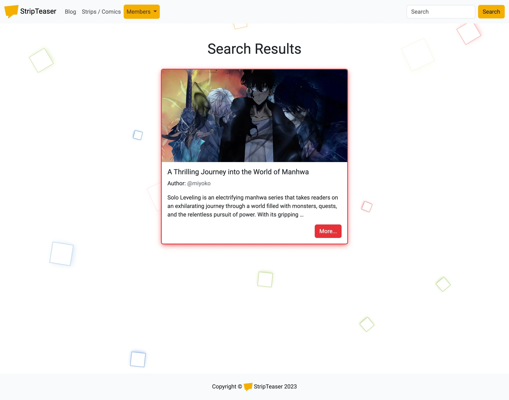
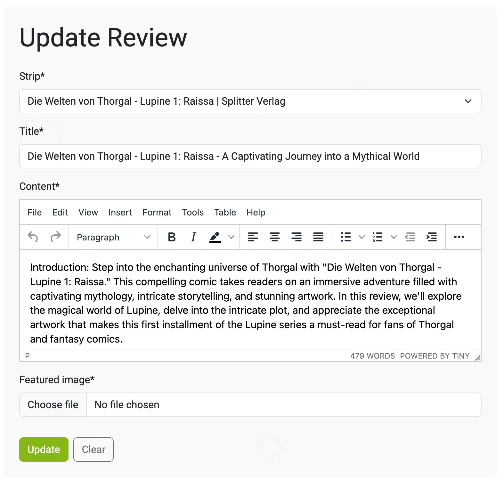

[StripTeaser Blog](https://strip-teaser.herokuapp.com/) is designed as a place where fans of the ninth art will be able to write sneak peeks, and reviews, about different comic releases to promote and popularize comics. The idea itself came from being a comic book lover and collector myself. The name of the blog comes from a comic strip (in some countries a comic is called just a strip ([An editor named Dušan Timotijević named the new art form "strip", after English "comic strip"](https://en.wikipedia.org/wiki/Serbian_comics)), and with a play on words I came up with a slightly provocative name but also an attractive name.

[Here you have a live version of the project.](https://strip-teaser.herokuapp.com/)  

---  

## Table of Contents

1. <details>
   <summary><a href="#ux">UX</a></summary>

   - [Visitor Goals](#visitor-goals)
   - [Business Goals](#business-goals)
   - [User Stories](#user-stories)

   </details>
   
2. <details>
    <summary><a href="#visual-design">Visual Design</a></summary>

      - [Wireframes](#wireframes)
      - [Colors](#colors)
      - [Fonts](#fonts)
      - [Icons](#icons)

</details>

3. <details>
   <summary><a href="#styling-formatting-and-features">Styling, Formating and Features</a></summary> 
    
    - [Future Features](#future-features)

</details>

4.  <details>
    <summary><a href="#validation-and-testing">Validation and Testing</a></summary>
    <ul>
    <li><a href="#validation">Validation</a></li>
    <li><a href="#testing">Testing</a></li>

    <li>
    <details>
    <summary><a href="#bugs">Bugs</a></summary>

    - [Fixed Bugs](#fixed-bugs)
    </details>
    </li>
    </ul>

</details>
  
5. <details>
    <summary> <a href="#deployment">Deployment</a></summary>

      - [Local Deployment](#local-deployment)
      - [Heroku Deployment](#heroku-deployment)

</details>

6. <a href="#tools-and-platforms">Tools and Platforms</a>

7. <a href="#content-and-credits">Content and Credits</a>

8. <a href="#media">Media</a>
  
---  
  
## UX


### Visitor Goals  

The target audience for [StripTeaser Blog](https://strip-teaser.herokuapp.com/) are:  
- People who are interested in comics and caricature art.
- People who like to read a quality and interesting reviews.
- People who like to express their opinion through writing reviews.
- People who want to find out if the comic book they are interested in buying is suitable for their affinities.


### Business Goals  

The Business Goals of [StripTeaser Blog](https://strip-teaser.herokuapp.com/) are:  
- To gather a group of quality authors of reviews.
- To provide quality reviews of comics both new and old.
- To become a relevant factor in the evaluation of comics in the future.
- To become an online shop, when a certain number of authors and readers gather.


### User Stories  

- As a **Site Admin** I can **approve or disapprove posts** so that **I can filter out the irrelevant posts**
- As a **Site Admin / Registered User** I can **use Rich Text Editor** so that **I can style my blog posts, add images and links**
- As a **Site Admin / Owner** I can **have neat code with comments** so that **other developers can quickly figure out what it's for**
- As a **Site Admin / Owner** I can **have ReadMe** so that **I can provide enough documentation and guide for other developers who are interested in project**
 - As a **Site User** I can **register account** so that **I can add a short biography and avatar, so that the readers know something about me as author**
 - As a **Site User** I can **view a list of comics** so that **I can select one to read about comic book release specs**
 - As a **Site User** I can **view a list of posts** so that **I can select one to read and see exactly which edition is being written about**
 - As a **Site User** I can **search the blog** so that **I can find what I'm interested in based on the comic's name, author, or content keyword**
- As a **Site User** I can **create, read, update and delete comments** so that **I can leave a review opinion as well as see other readers' review ratings** 
- As a **Site User / Registered User** I can **read news about  comics** so that **I am always updated with latest releases and announcements** 
 - As a **Registered User** I can **create, read, update and delete comics with detailed issue spec** so that **I or other members can write reviews for it, and visitors and collectors have an accurate insight into which product they are talking about**
 - As a **Registered User** I can **create, read, update and delete posts** so that **I can promote comics and give my opinion on certain releases**
- As a **Registered User** I can view custom error pages, example 404 so that **I can easily understand and navigate through them**
 - As a **Registered User** I can **send messages to authors of the review** so that **I can get in touch with them more easily** 
 - As a **Registered User** I can **reset password** so that **I don't have to create a new account in case I forget my password, but simply reset it** 
 - As a **Registered User** I can **participate in polls** so that **I and other can use the results to announce the best comics for different criteria**  

---  

## Visual Design


### Wireframes  
- The initial project wireframes. As they are created in the early planning stages, they may differ from the final project.  


### Colors  
- For the design, I had planned to create a blog with a clean look, so, at the very beginning, I decided that white color prevails (for a future feature of the site, a dark version will be implemented). In order for the site not to be too sterile and monotonous, I decided to assign different colors to details such as buttons, borders, and background animation elements, and in this way, the site becomes more dynamic and interesting.  

- The color palette I decided on is [eBay](https://www.ebay.de/) colors. The idea came while shopping on the site.  
  

### Fonts  
- For the font, I decided on the Roboto font, because it is easy to read.  
  

### Icons  
-  As the main icon, which was also used as a favicon, it was downloaded from the [Looka](https://looka.com).  
- I used to generate the favicon icon [Favicon Generator](https://www.favicon-generator.org/).  
  

- The others that were used for buttons and social links are from the [Font Awsome](https://fontawesome.com/). I tried to use icons that suggest what the button action is (for example, the trash can for the Delete button).  
  
  
---  


## Styling, Formatting and Features   


### Styling, Formatting, Features
- I wanted the design of the site to be clean, so the white color prevails, and to gain interest and dynamism, colors were inserted for certain elements. And I stuck to that concept for the entire site.
- The technologies I used to create the site are: HTML, CSS, JavaScript, [Django](https://www.djangoproject.com), [Python](https://www.python.org/), [Bootstrap](https://getbootstrap.com), [PostgreSQL](https://www.postgresql.org/).  
- Although Bootstrap was used for styling, I tried to add custom CSS and JavaScript so that the site would not look generic but a bit more unique.

- To implement the paginator I used the following source: [How to implement a paginator in a Django Class-based ListView compatible with Bootstrap 5](https://ourcodeworld.com/articles/read/1757/how-to-implement-a-paginator-in-a-django-class-based-listview-compatible-with-bootstrap-5).  
- I restricted access to unauthenticated and unauthorized users with the Django authentication system by implementing @login_required decorator, LoginRequiredMixin and UserPassesTestMixin with custom test functions([Django docomentation](https://docs.djangoproject.com/en/4.2/topics/auth/default/)).   
- I also applied this protection principle to other parts of the site where it was necessary to limit access to unauthenticated and unauthorized users.  

#### Home Page
- The first thing I wanted users to encounter were is a welcome message with a short introduction about the site itself, what the user can find, and what we have planned for the future.   
- As I mentioned I used the colors of the four basic eBay colors and to make the site more alive I used this tutorial to create a background animation ([Animated Background with Pure CSS and Html | No Javascript no Jquery](https://www.youtube.com/watch?v=qx7pSLjLNQA&list=PLwJhhWUZudKp7QPVALB_kXUyzj8cBB__L)).  
- And to make it even more lively, I used the JavaScript `Math.random` method so that every time the page is loaded, the squares get random colors.  
   

- The navigation bar is a Bootstrap navbar that has been modified for the needs of the project.   
  

- The title itself with the logo is a link to the home page.  
- I decided to highlight, in my opinion, important elements in yellow.  
  

- The search functionality is limited to searching the post content itself, titles, authors of posts, writers and artists of comics, as well as publishers. Because I thought that these are the most important things that could interest the reader.
- I achieved the functionality with the help of an article from [Stackoverflow](https://stackoverflow.com/questions/13416502/django-search-form-in-class-based-listview).  
  

- The search results page is simple with an appropriate heading.  
  
  

#### Blog   
- When designing the Blog List page, I decided to display four posts, so that the page would not be crowded and the user would have more attention when there is less content.  
- So that the posts themselves would not be boring, I decided to follow the order of eBay colors and assigned each post a button color and border with a box shadow in the order red, green, blue, and yellow. I implemented this with a simple JavaScript solution.   

	```const borderColors = ['red', 'green', 'blue', 'yellow'];  
    const cards = document.querySelectorAll('.card');   
	cards.forEach((card, i) => {.  
	    const randColor = borderColors[i % borderColors.length];
	    card.classList.add(randColor);
	});
    ```  
    
    

- I also wanted the Add New Review link to be available to registered members of the site, and I decided to position it just below the heading.  
   
  
- I decided that the first option for writing a review would be to choose a comic book to write about.  
- And immediately after that, I offer the site member to add a new comic about which he wants to write if it does not already exist in the database.  
- The other fields are basic, typical blog post fields such as title, body content, and image.  
- What I should add in the next version is the Excerpt field, instead of that field I used the django filter `truncatewords`, which can sometimes cause unwanted results if the introduction is too short and there is too much empty space after it.  
- The textual content (reviews) of the site is generated using ChatGPT, so there may be inconsistencies and inaccuracies in the data.   

##### TinyMCE  
- So that the posts themselves could be nicely formatted, to add subtitles, images, I decided to implement the Rich Text Editor and I added a `safe` filter to render the content properly.  
- I first decided on the CK-Editor, however, there was a problem where the editor itself did not appear at first, and then it was displayed without icons when deployed. In production, it worked as it should. Since my static files are on Cloudinary, and they automatically rename the files, that's why the error occurred probably. Since I was unable to correct those errors after several attempts, where I tried to push the files without automatic renaming, I decided to try another editor and see if I would encounter the same problem. And I decided on TinyMCE, because I saw that it has a CDN, so if I have problems with renaming, I can use the CDN. The results were the same as for CK-Editor, but after configuring the link for tinymce to cdn everything worked as it should. 
  ```
  TINYMCE_JS_URL = 'https://cdn.tiny.cloud/1/no-api-key/tinymce/5/tinymce.min.js'
  TINYMCE_COMPRESSOR = False
  ```
    

- To upload an image, I used CloudinaryFileField ([with the help of this article I implemented it in this project](https://jszczerbinski.medium.com/django-web-app-and-images-cloudinary-straightforward-study-ae8b5bb03e37) and [this one](https://support.cloudinary.com/hc/en-us/articles/202520762-Uploading-assets-and-keeping-their-original-filenames)), which has, next to the image selection field, a field that displays a link to the image that is currently being used.   
  
- For all forms I used [django-crispy-forms](https://django-crispy-forms.readthedocs.io/en/latest/) and for the field the currently selected image did not display the image address (problem probably caused by crispy-forms). Since the user already sees the selected image or avatar, I decided to target that field with a css selector and set display to none.  

- Also, after a successfully created post and for every other successfully created content, the user receives a django success message, which was implemented with the help of Code Institute I Think Therefore I Blog.  

##### Blog Post  
- For the display of the blog post itself, I decided that in addition to the content of the post itself, a link to the author's profile, which can only be visited by registered users, should be available.  
- And also a card on the side with the technical data of the edition being written about.  
  

- The author of the post itself has links available at the bottom to upgrade or delete posts.  
   

- For the upgrade page, I simply used the same form as for creating a new one just prepopulate with content details.  
- In case the user wants to delete the post, he must first confirm in order to avoid accidental deletion.  
  

#### Strips / Comics  
- For the list of available comics for review, I decided to follow the design of the blog page, increasing the number of objects to six displayed on one page.  
  
  

- For just creating a new comic, I decided on the technical data of the comic that I considered the most important, although there is room to expand and even divide it into several models.  
- For fields like Coloring and Binding, I defined the possibility of selection in the model itself.  
- While for countries I used a package [django-countries](https://pypi.org/project/django-countries/).  
- And for years I used the [stackoverflow solution](https://stackoverflow.com/questions/49051017/year-field-in-django).  
- The same concept is used for the image field as for the blog post image.  

- The first thing a user sees is the cover of comic, the title and the name of publisher, and clicking the Details button reveals the rest of the information, for this solution I used Bootstrap collapse.  

- The card itself shows all the technical information about the issue and I purposely made it narrow and long to resemble a 'strip'.  
  


- Since I think it's pretty clear like this, I decided not to create a separate page for individual comics, but left it like this because the content is not extensive and yet it seemed clear to me.  
- For the upgrade page, I simply used the same form as for creating a new one just prepopulate with content details.  


- In case the user wants to delete the post, he must first confirm in order to avoid accidental deletion.  


#### Members  
- It is meant to be highlighted, in this case in yellow to emphasize importance. There you can find all the features for members of the site.  
  
- Sign In from the page has a fairly simple design and uses the Django built-in login functionality, with a query if the user is registered at all and a link to the registration page.  
  

- The Sign Up page functionality itself also uses it Django built-in login functionality.  


- Unlike the basic registration page, fields for email are added as mandatory, first name, last name as additional fields.  

- Also, I did not center the positions of the cards, because it seemed to me that when they are near the top like this, they are more noticeable and readable.   

- As an addition, I implemented a [Django `send_mail`](https://docs.djangoproject.com/en/4.2/topics/email/) functionality so that after registering and creating a profile, the user receives a welcome email.   
   

- And it also has a query whether the user is already registered and if so a link to the Sign in page.  

- In addition to the basic personal data, I decided to extend the User model with additional information about registered members such as a short biography, location and avatar.  

- I deliberately did not decide to set a default avatar, because I did not want to impose on the members or offend someone if I set as a default avatar that they do not like.  

- For the display of the profile card itself, I decided to follow the concept of the site and the same as for the update page and the delete button.  

- With that I added a link to the email of the users profile.  

- I used a modal for Sign Out, I got the idea from this channel [Django Mastery](https://www.youtube.com/@djangomastery) and plan to implement it in future versions of the site for all confirmation queries.  


#### Footer  
- The footer itself is simple with copyright text and site logo.  

- And the year that is updated with JavaScript.  
   

#### HTTP Errors  
- I also made custom error pages 403, 403 CSRF, 404 ([Django documentation](https://docs.djangoproject.com/en/4.2/ref/views/#the-404-page-not-found-view)).  
  
  
  


### Database  
- This diagram was created during the design of the site and deviations from the final design are possible.   
   

- Here is a representation of the final model database solution.   
#### Member Model
|Column Name|Validation|Field Type|
|---|---|---|
|user|on_delete=models.CASCADE|FK to Django User Model|
|about|blank=True, null=True|tinymce_models.HTMLField|
|location|max_length=100, blank=True|CharField|
|avatar||CloudinaryField|   

#### StripPost Model   
|Column Name|Validation|Field Type|
|---|---|---|
|author|on_delete=models.CASCADE, related_name='spost'|FK to Django User Model|
|strip|on_delete=models.CASCADE, related_name='strip'|FK to StripDetail|
|title|max_length=100, blank=False, null=False, unique=True|CharField|
|slug|max_length=150, blank=False, null=False, unique=True|SlugField|
|content|blank=False, null=False|tinymce_models.HTMLField|
|featured_image||CloudinaryField|
|created_on|auto_now_add=True|DateTimeField|
|updated_on|auto_now=True|DateTimeField|
|approved|default=False|BooleanField|    

#### StripDetail Model   
|Column Name|Validation|Field Type|
|---|---|---|
|user|on_delete=models.CASCADE|FK to Django User Model|
|title|max_length=100, blank=False, null=False, unique=True|CharField|
|slug|max_length=250, blank=False, null=False, unique=True|SlugField|
|strip_cover||CloudinaryField|
|artist|max_length=100, blank=False, null=False|CharField|
|writer|max_length=100, blank=False, null=False|CharField|
|publisher|max_length=100, blank=False, null=False|CharField|
|year|blank=False, null=False|PositiveIntegerField|
|coloring|max_length=50, choices=COLORING_CHOICE|CharField|
|binding|max_length=50, null=False, blank=False, choices=COVER_CHOICE|CharField|
|country|blank=False, null=False|CountryField|
|pages|blank=False, null=False|PositiveIntegerField|     

- The possibility of expanding the database exists, the fields with a choice, as well as the fields of the writer and the artist should be expanded, if not and make separate models with biographies of the writer or in the case of a choice so that members can add new options depending on the need.   


### Future Features  
- Improve performance for the mobile version
- Add search filters
- Profile page to contain user posts
- Add Dark theme
- Add division by genres
- Add option to add image gallery for posts
- Add an online comic shop
- Adding social links, as well as youtube in footer
- Improve and expand models
---  

## Validation and Testing

### Validation   
- Python files have passed validation through [CI Python Linter](https://pep8ci.herokuapp.com/), for some lines of code longer than 79 characters `# noqa` to ignore warnings in `settings.py` and `env.py`.   
- JavaScript custom shows "One undefined variable bootstrap" when tested with [JSHint](https://jshint.com/).
- First I used [Autoprefixer](https://autoprefixer.github.io/) to add vendor prefixes and then validate with [W3C CSS Validation Service](https://jigsaw.w3.org/css-validator/) and it shows no errors.  
- I tested the HTML page by page by copying the source code and directly input validating at [W3C Markup Validation Service](https://validator.w3.org), I had one error because I recklessly used the `<h1></h1>` tag for each individual page, but I corrected it to the `<h2></h2>` tag. And it shows no errors now.
- On Google Lighthouse, the results varied between 90 and 100, with the fact that for mobile devices the performance tests sometimes dropped to 70, while for other items they remained in the range of 90 to 100. It has been prioritized to be improved in the next version

### Testing   
- Regarding responsiveness, the site was tested on several different devices and proved to be satisfactory, although there is room for improvement.   
- Creating a user and getting a welcome email based on testing so far works well, although the message needs to be formatted better.  
- Readability is good on all tested devices, but since the site is quite bright and this may bother some people, a dark version is recommended for the upgrade.   

<table>
   <thead>
     <tr>
       <th>Expected </th>
       <th>Testing</th>
       <th>Result</th>
       <th>Fix</th>
   </thead>
   <tbody>
     <tr>
       <td>When I am logged in I can see on the blog page a link to Add New Review, if I am not logged in, the link must not be available to me.</td>
       <td>I accessed the blog page with different accounts, also as non logged in user.</td>
       <td> When I was logged in the link was available to me, while when I accessed the page without an account, the link was not available to me.</td>
       <td>No fix needed.</td>
     </tr>
     <tr>
       <td>The url to [create new post](https://strip-teaser.herokuapp.com/blog/create/) cannot be accessed directly if the user is not registered.</td>
       <td>I tried to access the URL before implementing LoginRequiredMixin and after implementing. I tried as logged in user with few different accounts and not logged in user.</td>
       <td>Before implementing LoginRequiredMixin I was able to access the page. After the implementation of the mixin, when visiting the address for creating post, I was redirected to the Sign In page.</td>
       <td>No fix needed.</td>
     </tr>
     <tr>
       <td>Only the registered user and author of the post can have access to the links for Update and Delete post.</td>
       <td>I have tried to access as logged in and as a non-logged user of the site.  I repeated the test with several different accounts.</td>
       <td>I did not have direct access to the links through the buttons as non logged in. While I had as a logged in user and only for the posts that I am the author of.</td>
       <td>No fix needed.</td>
     </tr>
     <tr>
       <td>I can only access the strip update address (https://strip-teaser.herokuapp.com/blog/post/slug/) if I am registered and the author of that post.</td>
       <td>I tried to access the page before and after the implementation of LoginRequiredMixina and UserPassesTestMixin with a test that checks if the logged in user is the author of the comic. I repeated the test with several accounts and on several posts, also as non logged in user.</td>
       <td>I could access, after the implementation I could only access if I was logged in and the author of the post. If I was not logged in, I was redirected to the Sign In page. Whereas if I wasn't the author and was logged in, I got HTTP 403 Forbidden.</td>
       <td>No fix needed.</td>
     </tr>
     <tr>
       <td>I can only access the strip delete address (https://strip-teaser.herokuapp.com/blog/delete/slug/) if I am registered and the author of that post.</td>
       <td>I tried to access the page before and after the implementation of LoginRequiredMixin, UserPassesTestMixin with a test that checks if the logged in user is the author of the comic I repeated the test with several accounts and on several posts also as non logged in user.</td>
       <td>I could access, after the implementation I could only access if I was logged in and the author of the post. If I was not logged in, I was redirected to the Sign In page. Whereas if I wasn't the author and was logged in, I got HTTP 403.</td>
       <td>No fix needed.</td>
     </tr>
     <tr>
       <td>As logged in user I can see on the Strips / Comics page a link to Add New Strip, if I am not logged in, the link must not be available to me.</td>
       <td>I tired to access the Strips / Comics page with different accounts, and also as non logged in user.</td>
       <td>As a result the link was available to me when I was logged in, while when I accessed the page without an account, the link was not available to me.</td>
       <td>No fix needed.</td>
     </tr>
     <tr>
       <td>Links for modifying and deleting comic details can only be accessed by me as a logged in member and creator.</td>
       <td>I tried to access the page as a registered user, with several different accounts and as a non-registered site visitor,</td>
       <td>The results are such that the links were available to me as a logged-in member and creator, while as a logged-in but not creator, I could not see the links as well as when I accessed the page as a non-logged-in user.</td>
       <td>No fix needed.</td>
     </tr>
     <tr>
       <td>I can't access the link to modify or delete the comic details via direct link example: https://strip-teaser.herokuapp.com/strip-details/update/slug/ or for delete https://strip-teaser.herokuapp.com/strip-details/delete/slug/.</td>
       <td>I've tried logging in as a registered user with several different accounts and I've tried as a non-registered user.</td>
       <td>As a registered user but not a creator I was getting HTTP 403 Forbidden and as a non-logged in user I was redirected to the Sign In page.</td>
       <td>No fix needed.</td>
     </tr>
          <tr>
       <td>When I try to access User profile page, https://strip-teaser.herokuapp.com/member/profile/pk/,  I shouldn't see links for updating and deleting profile.</td>
       <td>I tried to access the page as a non-registered user and with several different accounts.</td>
       <td>As a result of testing I did not have direct access to the links.</td>
       <td>No fix needed.</td>
     </tr>
     <tr>
       <td>When I try to access User profile page https://strip-teaser.herokuapp.com/member/profile/delete/pk/ or https://strip-teaser.herokuapp.com/member/profile/update/pk/ I shouldn't see links for updating and deleting profile.</td>
       <td>I accessed the links from several different accounts and as an unregistered user. For more different profiles.</td>
       <td>As a non-registered user, I was redirected to the Sign In page when trying to access the profile update page. As a registered user, I was directed to the update page of the logged-in user. As a non-registered user I was redirected to an HTTP 404 when trying to access the delete profile page. As registered I was getting HTTP 403.</td>
       <td>No fix needed.</td>
     </tr>
   </tbody>
 </table>


### Bugs   
- For all forms I used [django-crispy-forms](https://django-crispy-forms.readthedocs.io/en/latest/) and for the field the currently selected image did not display the image address (problem probably caused by crispy-forms). Since the user already sees the selected image or avatar, I decided to target that field with a css selector and set display to none. So to say this bug is not solved, it is 'hidden'. But since it's more of an aesthetic problem, I think the current solution is fine.  


#### Fixed Bugs  
- I had to fill in the slug field manually, which is not user friendly, but I solved the problem with the help of the [article](https://learndjango.com/tutorials/django-slug-tutorial).  
- When implementing a JavaScript solution for border color, I initially used a `for in` loop and the results were inconsistent and I was getting `script.js:21 Uncaught TypeError: Cannot read properties of undefined (reading 'add')`, after research and reading [MDN](https://developer.mozilla.org/en-US/docs/Web/JavaScript/Reference/Errors/Invalid_for-in_initializer#array_iteration) I came to the knowledge that : The for...in loop shouldn't be used for Array iteration. So i used `forEach` method.  
- Since class based views are similar in speed, I copied StripDetailView and wanted to adjust StripPostDetailView but I forgot to change the model and form_class. So the results were wrong, but after checking the code I immediately saw the error.  
- The background animation did not span the entire height. After examining in Chroma developer tools, I saw that I had wrongly assigned the absolute position, I corrected it and assigned it to the main element, considering that the animation wrapper is a child of the main element.  
- A line of code for the dismiss message caused an error:
    ```
    setTimeout(() => {
        let messages = document.getElementById('msg');
        let alert = new bootstrap.Alert(messages);
        alert.close();
    }, 2500);
    ```
  
  ```
  Uncaught TypeError: Cannot read properties of null (reading 'defaultPrevented') at q.close (alert.js:21:22) at script.js:5:11
  ```
- I solved the problem by setting a condition that determines if there is a message at all. And the code now works without error.
    ```
    let messages = document.getElementById('msg');
    if (messages) {
        setTimeout(() => {
            let alert = new bootstrap.Alert(messages);
            alert.close();
        }, 2500);
    }
    ```
- Another bug that existed was:
    ```
    Access to manifest at 'https://res.cloudinary.com/dvkbdh57c/raw/upload/v1/static/favicon/manifest.b58fcfa7628c.json' from origin 'https://strip-teaser.herokuapp.com' has been blocked by CORS policy: The value of the 'Access-Control-Allow-Origin' header in the response must not be the wildcard '*' when the request's credentials mode is 'include'.
    ```
    ```
    GET https://res.cloudinary.com/dvkbdh57c/raw/upload/v1/static/favicon/manifest.b58fcfa7628c.json net::ERR_FAILED 200
    ```
- I tried to solve by installing and setting [django-cors-headers 4.0.0](https://pypi.org/project/django-cors-headers/) per the tips I found on stackoverflow.
- I ended up contacting [Cloudinary](https://cloudinary.com/) customer support. Explained the situation and the problem and they suggested I used `crossorigin="use-credentials"` for a link to the manifest. I forgot about that line of code, because I put it in because I had a manifest error in my production code. Now there is no more error and thanks again for the support from [cloudinary](https://cloudinary.com/).   
- I also had difficulties with the Rich Text Editor, I wrote more [TinyMCE](#tinymce).  
---  

## Deployment  
#### How to Clone

1. Go to the repository of [project](https://github.com/radule90/CI_PP__4)
2. Click on the Code button above the list of files
3. Choose one of remote URL: HTTPS, SSH, GitHub CLI and click the copy button or download a copy of the [project repository](https://github.com/radule90/CI_PP__4/archive/refs/heads/main.zip) and extract the zip file to your base folder.
4. In your IDE Terminal change the current working directory to the one where you want the clone
5. Type following code (for example is used GitHub CLI URL) in Git Bash/Terminal of IDE and press Enter:

   ```
   https://github.com/radule90/CI_PP__4.git
   ```

6. In order to work properly, it needs to be installed  project requirements, type following code in Git Bash/Terminal:

   ```
   pip3 install -r requirements.txt
   ```

7. Update `ALLOWED_HOSTS` in `settings.py`, create evn.py file and change valuse:

   ```
   import os
   
   os.environ["DATABASE_URL"] = "Your URL of ElephantSQL instance"  
   os.environ["SECRET_KEY"] = "Your secret key"  
   os.environ["CLOUDINARY_URL"] = "Cloudinary Api URL"   

   # For Debug to be True in production and False in deployment
   os.environ.setdefault("DEBUG", "True")

   # Please note that the email provider only uses password authentication, 2-factor authentication will not work
   os.environ["EMAIL_HOST_USER"] = "Your email address"
   os.environ["EMAIL_HOST_PASSWORD"] = "Your email password"
   ```

8. Run the migrate command to create the data tables.  
   `python3 manage.py migrate`   

9. Create a superuser:
   `python3 manage.py createsuperuser`    

10. Run the local server:   
    `python3 manage.py runserver`    


#### How to Fork

1. Go to the repository of [project](https://github.com/radule90/CI_PP__4)
2. Bellow navigation bar on the top of the page in right corner you will locate Fork button
3. When clicked, you should have a copy of repository in your GitHub


### Heroku Deployment
- A requirements.txt file created with pip freeze > requirements.txt.
- Procfile `web: gunicorn stripteaser.wsgi`
- Create a new [Heroku](https://heroku.com/) app, select name and region  
- Add Config Var to Heroku settings, where key is PORT and the value is 8000 and also add Congig Vars for:   
   ```
   CLOUDINARY_URL   "Cloudinary Api URL"   
   DATABASE_URL     "Your URL of ElephantSQL instance"  
   EMAIL_HOST_PASSWORD      "Your email password"    
   EMAIL_HOST_USER      "Your email address"   
   SECRET_KEY   "Your secret key"  
   ```
  
- In Settings, set the buildpacks to Python 
- In Deploy section, select the Github repository from the menu
- Link the Heroku app to the Github repository  
- Deploy the repository  
- Click the View App button to see live version of the project    
  
---   

## Tools and Platforms

- [Codeaynwhere](https://codeanywhere.com/) - IDE for project development
- [Github](https://github.com/) - Storing code remotely
- [Heroku](https://heroku.com/) - Deployment
- [ElephantSQL](https://www.elephantsql.com) - Database hosting service
- [Cloudinary](https://cloudinary.com/) - Image storage
- [Django](https://www.djangoproject.com) - Python web framework
- [CI Python Linter](https://pep8ci.herokuapp.com/)
- [JSHint](https://jshint.com/) - JSHint, a JavaScript Code Quality Tool
- [W3C Markup Validation Service](https://validator.w3.org)
- [W3C CSS Validation Service](https://jigsaw.w3.org/css-validator/)
- [CSS Autoprefixer](https://autoprefixer.github.io/) - Autoprefixer CSS online
- [Autoprefixer](https://autoprefixer.github.io/) - Autoprefixer is a PostCSS plugin which parses your CSS and adds vendor prefixes
- [Balsamiq Wireframes](https://balsamiq.com/) - To create wireframes
- [DrawSQL](https://drawsql.app/) - database diagrams
- [Python](https://www.python.org/)
- [Bootstrap](https://getbootstrap.com)
- [Am I Responsive](https://ui.dev/amiresponsive) - For device mockup images
- [FireShot: Full Webpage Screenshots + Annotations](https://getfireshot.com/) - Screen Capture
- [cloudconvert](https://cloudconvert.com/png-to-webp) - Online png to webp converter  
- [Favicon Generator](https://www.favicon-generator.org/)
- [TinyMCE](https://www.tiny.cloud/) - Rich Text Editor
---

## Content and Credits

- The following tutorials and articles helped me arrive at the final code solution
  - [Code Institute](https://codeinstitute.net/de/)
  - Rory Patrick Sheridan (Mentor) - Great advice and guidance
  - [Django documentation](https://www.djangoproject.com/) - Additional learning resources
  - [W3Schools](https://www.w3schools.com) - Additional learning resources
  - [Corey Schafer](https://www.youtube.com/@coreyms) - Great tutorials and learning resource
  - [Django Mastery](https://www.youtube.com/@djangomastery) - Great tutorials and learning resource
  - [Dennis Ivy](https://www.youtube.com/@DennisIvy) - Tutorials and learning resource
  - [Django web app and images — Cloudinary straightforward study](https://jszczerbinski.medium.com/django-web-app-and-images-cloudinary-straightforward-study-ae8b5bb03e37) - 
  - [Animated Background with Pure CSS and Html | No Javascript no Jquery](https://www.youtube.com/watch?v=qx7pSLjLNQA&list=PLwJhhWUZudKp7QPVALB_kXUyzj8cBB__L) - Code used and adapted for background animation
  - [How to implement a paginator in a Django Class-based ListView compatible with Bootstrap 5](https://ourcodeworld.com/articles/read/1757/how-to-implement-a-paginator-in-a-django-class-based-listview-compatible-with-bootstrap-5)
  - [Django Countries](https://pypi.org/project/django-countries/) - Django application that provides country choices for use with forms
  - [Image resizing and cropping](https://cloudinary.com/documentation/resizing_and_cropping)  
  - [Django Slug Tutorial](https://learndjango.com/tutorials/django-slug-tutorial)  
  - [ChatGPT](https://openai.com/blog/chatgpt) - For textual content (example: comic reviews)   
---

## Media

- I used images from the sites listed below for my project, so all credit goes to them as well as the authors of the comics themselves
  - [Looka](https://looka.com) - Logo for the site
  - [Najkula](https://najkula.rs)  - Comics publishing house from Serbia
  - [Fantagraphics](https://www.fantagraphics.com) - Comics publishing house from The USA
  - [Splitter](https://www.splitter-verlag.de) - Comics publishing house from Germany
  - [All-Verlag](https://www.all-comic.de/) - Comics publishing house from Germany